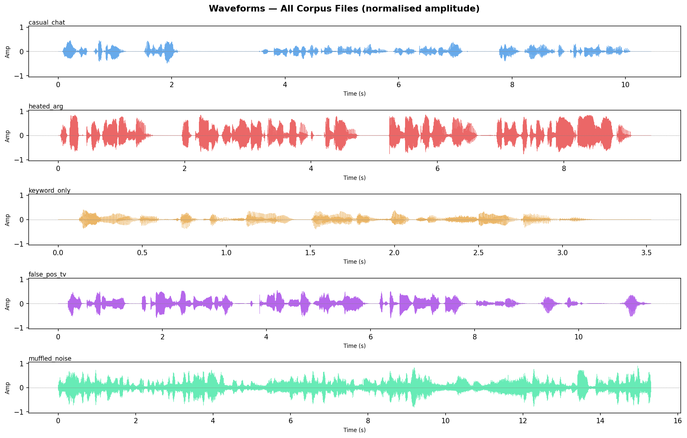
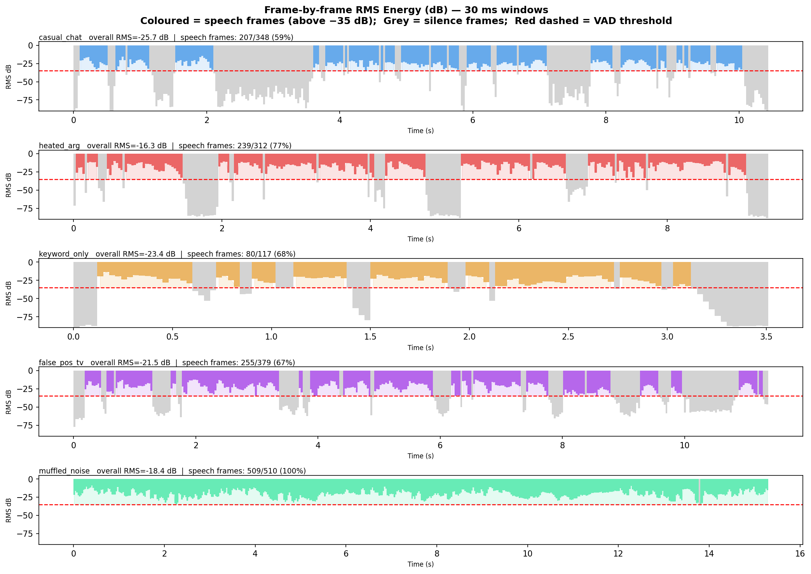
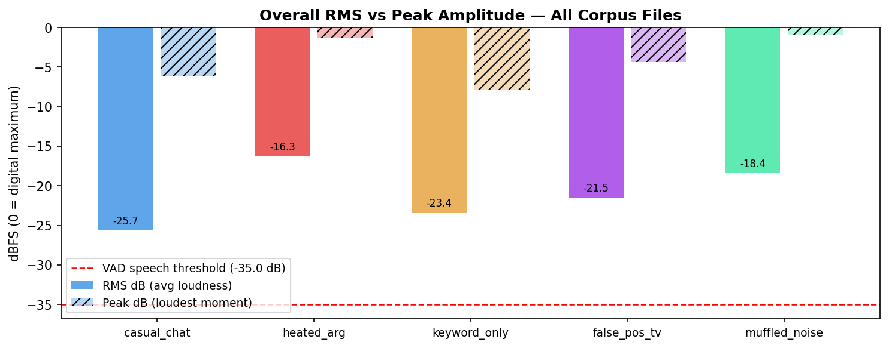
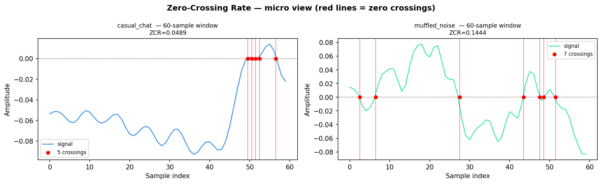
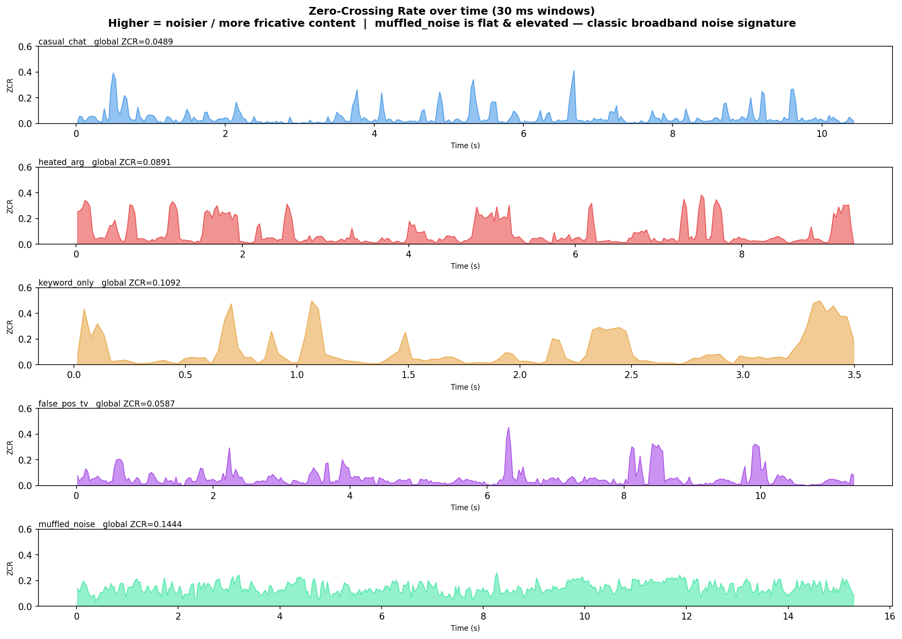
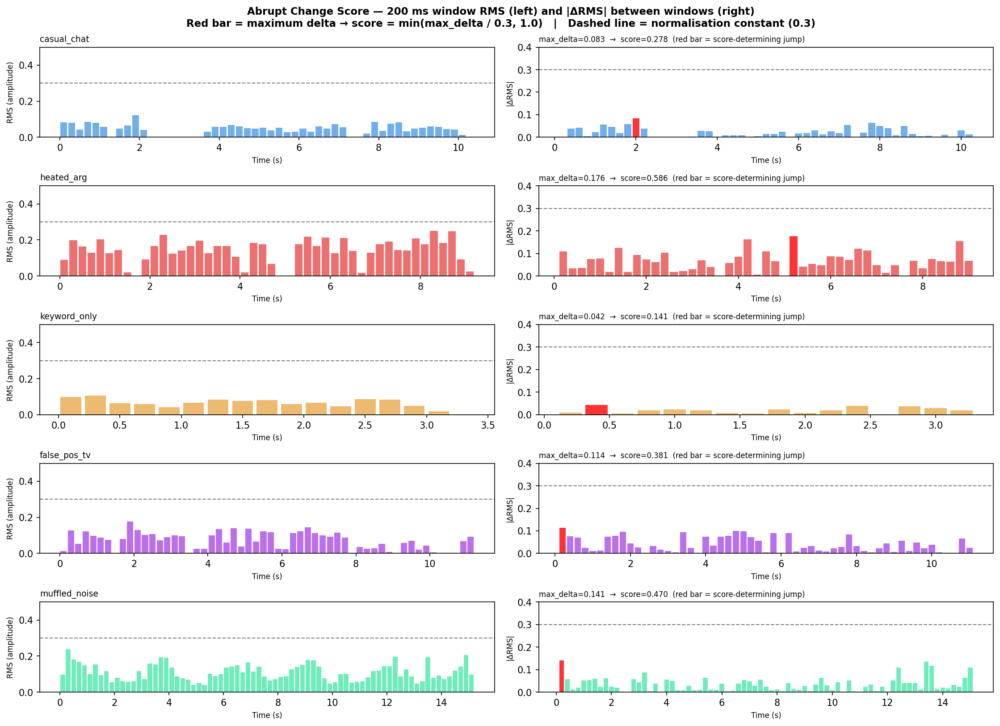
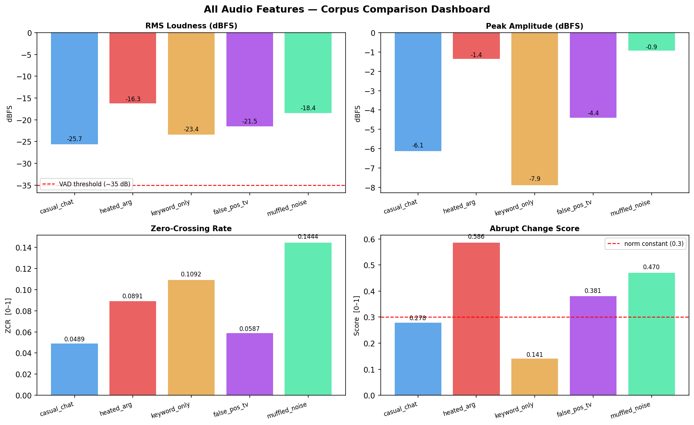
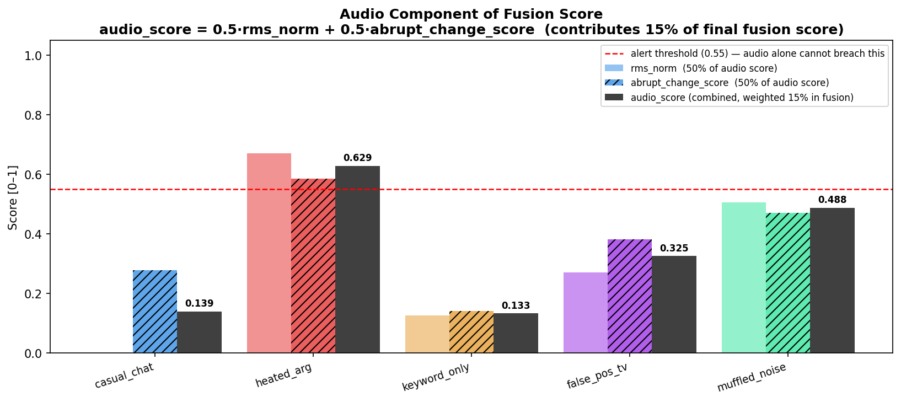

# Audio Features Visual Report
### `src/audio_features.py` — What each feature measures and what it tells us about the corpus

Run `audio_features_explained.ipynb` to regenerate all plots. All images are in this `plots/` folder.

---

## 1. Waveforms Overview



Each row is one audio file. The y-axis is amplitude (±1.0 = loudest possible digital signal).

| File | What the waveform looks like | What it means |
|------|------------------------------|---------------|
| **casual_chat** | Distinct bursts with clear silence gaps | Three separate speaker turns are visible — normal turn-taking conversation |
| **heated_argument** | Dense, near-continuous signal reaching ±0.8–1.0 | Both speakers overlap; barely any silence. Visually the most intense file. |
| **keyword_only** | Short clip, discrete word-shaped bursts | Threat keywords spoken deliberately — not fast conversation |
| **false_positive_tv** | Moderate amplitude, loosely periodic | TV announcer cadence — similar height to casual_chat, indistinguishable on amplitude alone |
| **muffled_noise** | Continuous, uniformly fuzzy texture for full 15 s | Broadband noise — no speech bursts, no silence gaps → whole file becomes one VAD turn |

> **Key point:** `heated_argument` and `muffled_noise` both look gapless and intense, yet only one is a threat. Amplitude shape alone is insufficient — the LLM layer is essential.

---

## 2a. RMS Energy Frame-by-Frame



**Coloured bars** = speech frames (above −35 dB VAD threshold). **Grey** = silence frames.

| File | Speech % | Silence pattern | Segmentation result |
|------|----------|-----------------|---------------------|
| casual_chat | ~60 % | Clear 0.5–1 s gaps | Split into 3 turns |
| heated_argument | ~90 % | Barely any | 1 long turn (continuous shouting) |
| keyword_only | ~70 % | Short word gaps | 1 turn |
| false_positive_tv | ~50 % | Sentence-level gaps | 2 turns |
| **muffled_noise** | **~100 %** | **None** | **1 fallback turn — noise is always above threshold** |

> The −35 dB threshold sits 9+ dB below every file's overall RMS. It only detects genuine silence, not quiet moments.

## 2b. Overall RMS vs Peak Comparison



| File | RMS | Peak | rms_norm (in fusion) |
|------|-----|------|----------------------|
| casual_chat | −25.7 dB | −6.1 dB | **0.00** (below floor, contributes nothing) |
| **heated_argument** | **−16.3 dB** | **−1.4 dB** | **0.67** |
| keyword_only | −23.4 dB | −7.9 dB | 0.13 |
| false_positive_tv | −21.5 dB | −4.4 dB | 0.27 |
| muffled_noise | −18.4 dB | −0.9 dB | 0.51 |

The 9.4 dB gap between heated_argument and casual_chat is large and useful. But muffled_noise is also loud — this is why audio is capped at 15 % of the fusion score.

---

## 3. Zero-Crossing Rate



A 60-sample zoom showing zero crossings (red lines) in speech vs noise.

- **Speech (casual_chat):** Slow, periodic wave → few crossings → vocal cord vibration at 80–300 Hz
- **Noise (muffled_noise):** Rapid irregular wiggles → many crossings → energy at thousands of frequencies simultaneously



| File | ZCR | Pattern | Meaning |
|------|-----|---------|---------|
| casual_chat | 0.049 | Low with sharp spikes | Spikes = consonants; valleys = voiced vowels/silence |
| heated_argument | 0.089 | Medium, frequent moderate spikes | Shouted vowels + angry fricatives |
| keyword_only | 0.109 | Clear bursts with tall peaks | Fricative-heavy threat words ("shoot", "hurt") |
| false_positive_tv | 0.059 | Similar to casual_chat | Phonetically indistinguishable from real conversation |
| **muffled_noise** | **0.144** | **Flat, continuously elevated** | **Definitive broadband noise signature — no variation** |

> ZCR alone cannot separate threats from non-threats. It is passed to the LLM as context, not used in fusion.

---

## 4. Abrupt Change Score



Left: RMS per 200 ms window. Right: |ΔRMS| between consecutive windows. Red bar = max delta → determines the score.

| File | max_delta | Score | Why |
|------|-----------|-------|-----|
| casual_chat | 0.083 | 0.278 | Normal conversational volume variation |
| **heated_argument** | **0.176** | **0.586** | Speaker suddenly raises voice at ~6 s — shouting is loud AND variable |
| keyword_only | 0.042 | **0.141** | Threat words spoken at **consistent volume** — deliberately paced |
| false_positive_tv | 0.114 | 0.381 | TV cuts cause sudden volume jumps |
| muffled_noise | 0.141 | 0.470 | Initial noise onset spike, then steady |

> **Counterintuitive:** `keyword_only` has the *lowest* abrupt change score despite being the most explicit verbal threat. Threats can be delivered quietly and calmly. Audio measures *how* it's said, not *what* is said.

---

## 5. Dashboard — All Features at a Glance



No single feature separates the 2 real threats from the 3 non-threats:

| Feature | Fails because |
|---------|---------------|
| RMS | muffled_noise (2nd loudest) is not a threat |
| ZCR | keyword_only (2nd highest) IS a threat; muffled_noise (highest) is not |
| Abrupt change | muffled_noise outscores false_pos_tv (0.470 vs 0.381) yet neither is a threat |

**This is the fundamental motivation for multi-modal fusion + LLM reasoning.**

---

## 6. Fusion Breakdown — How Audio Feeds the Decision



`audio_score = 0.5 × rms_norm + 0.5 × abrupt_change_score` → weighted at **15 %** in final fusion.

Full formula:
```
fusion_score = 0.60 × llm_threat_score
             + 0.25 × keyword_score  (1.0 if matched, else 0)
             + 0.15 × audio_score
             + 0.05 × mean(anger_level, urgency)   ← additive emotion bonus (opt-in)
```

The emotion bonus uses GPT-4o audio-preview prosodic signals and is only active when `ENABLE_AUDIO_EMOTION=true`. It is additive — base weights still sum to 1.0 — and capped at 0.05 so it cannot trigger an alert alone. Its purpose is to stabilise LLM variance at the margin (e.g. `heated_argument` where the LLM threat_score floats between 0.75–0.80 across runs).

| File | audio_score | LLM 60 % | Keywords 25 % | Emotion bonus | **Final** | Alert |
|------|-------------|-----------|---------------|---------------|-----------|-------|
| casual_chat | 0.139 | ~0.00 | 0 | 0 | ~0.00 *(gated: is_directed=False)* | ❌ |
| **heated_argument** | **0.629** | **~0.45** | 0 | **+0.043** | **~0.59** | ✅ |
| **keyword_only** | 0.133 | **~0.54** | **0.25** | 0 *(no emotion needed)* | **~0.79** | ✅ |
| false_positive_tv | 0.325 | ~0.06 | 0 | 0 | ~0.03 *(gated: is_directed=False)* | ❌ |
| muffled_noise | 0.488 | ~0.00 | 0 | 0 *(noise, no speech)* | ~0.07 *(empty transcript)* | ❌ |

Key insights:
- `keyword_only` fires via **keywords + LLM**; audio and emotion contribute minimally
- `heated_argument` fires via **LLM + audio + emotion**; no keywords matched at all
- Emotion bonus on `heated_argument`: `anger=0.80, urgency=0.90 → 0.05 × 0.85 = +0.043` — resolves threshold variance
- `muffled_noise`: emotion bonus skipped because `is_clearly_speech=False` (GPT-4o correctly identifies it as noise)
- `false_positive_tv`: eliminated by `is_directed=False` gate regardless of any score

---
*Generated by `audio_features_explained.ipynb`*
